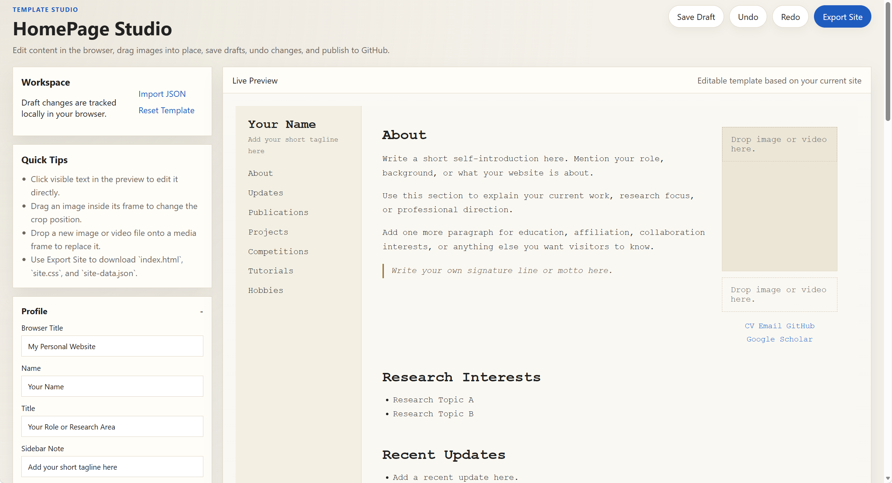

# HomePage Studio

`HomePage Studio` is a browser-based editor for generating a personal website from a privacy-safe academic homepage template. See a chinese tutorial [here.](README.zh-CN.md) Also pretty welcome to glance at my homepage [hengxiangchen.github.io](http://hengxiangchen.github.io).

## Current capabilities

- Live preview with the same overall structure as your personal site
- Direct text editing in the preview
- Drag image positioning inside media frames
- Drag-and-drop media replacement for image and video slots
- Local draft saving
- Undo and redo
- Export `index.html`, `site.css`, and `site-data.json`
- Upload exported files to GitHub through the GitHub Contents API
- Publish the exported site to GitHub Pages

## How to use

1. Open `index.html` in a browser.
   
2. Edit text either from the left control panel or directly in the preview.
3. Drag an image inside a frame to adjust its crop position.
4. Drop a local image or video file onto a media slot to replace it.
5. Click `Save Draft` to store the current state in browser storage.
6. Click `Export Site` to download the generated site files.
7. Fill in the GitHub section and click `Upload to GitHub` to publish.

## Privacy

- The default template contains only generic placeholder content.
- No real personal profile, publication list, school, email, or project data is preloaded.
- Replace all placeholders with your own information before publishing.

## Publish to GitHub Pages

1. Create a GitHub account at `https://github.com/` if you do not already have one.
2. Verify your email address after signup.
3. Create a repository.
   For a personal homepage, use the repository name `<your-username>.github.io`.
   For a project page, you can use any repository name.
4. Open the studio and finish editing your site.
5. Click `Export Site` or use the built-in GitHub upload form.
6. If you upload manually, place `index.html`, `site.css`, and `site-data.json` in the repository root.
7. In GitHub, open `Settings` > `Pages`.
8. Under `Build and deployment`, choose `Deploy from a branch`.
9. Select branch `main` and folder `/ (root)`, then save.
10. Wait for GitHub Pages to finish deployment.

Your page URL will usually be:

- `https://<your-username>.github.io/` for a user site
- `https://<your-username>.github.io/<repo-name>/` for a project site

## Notes

- The studio stores drafts in `localStorage`, so drafts are browser-specific.
- If you drop media files, the exported data can contain `data:` URLs. This is convenient for prototyping, but large files will increase the size of the exported HTML and JSON.
- GitHub upload requires a token with permission to write repository contents.
- If you use the GitHub upload form, create a Personal Access Token with repository contents write permission.
- Some browsers restrict `fetch()` behavior when opening local files. If that happens, serve the folder with a simple static server instead of double-clicking `index.html`.

## Suggested next steps

- Add a section schema editor so users can turn sections on and off
- Add asset packaging instead of embedding dropped media as `data:` URLs
- Add GitHub Pages workflow scaffolding
- Add theme presets and palette controls
